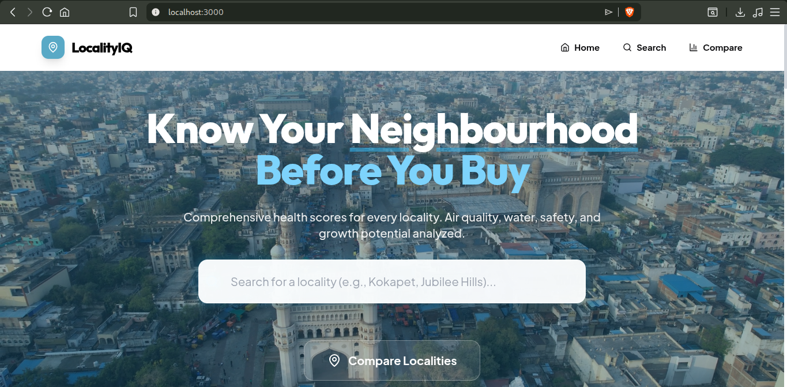

# LocalityIQ 🏠

**Neighbourhood Intelligence Platform** - Get comprehensive health scores for any locality worldwide.



## ✨ Features

- 🔍 **Search Any Locality** - Analyze any place worldwide
- 📊 **Live Data** - Real-time AQI, schools, hospitals
- ⚖️ **Compare** - Side-by-side locality comparison
- 📄 **PDF Reports** - Download professional reports
- 👤 **User Auth** - Save favorites and reports
- 🗺️ **Maps** - Interactive Leaflet maps

## 🚀 Quick Start

### 1. Install Dependencies

```bash
# Frontend
npm install

# Backend API
npm install
```

### 2. Configure API Keys (Optional)

Edit `api/.env`:
```env
LOCATIONIQ_API_KEY=your_key_here
```

Works without keys using free OpenStreetMap APIs!

### 3. Run

```bash
# Terminal 1 - API Server
node server.js

# Terminal 2 - Frontend
npm run dev
```

Open http://localhost:3000

## 📡 APIs Used

| API | Purpose | Cost |
|-----|---------|------|
| LocationIQ | Location search | Free tier |
| OpenStreetMap | Geocoding fallback | Free |
| OpenAQ | Air quality | Free |
| Overpass | Schools, hospitals | Free |

## 📁 Project Structure

```
localityiq/
├── app/                    # Next.js pages
│   ├── page.js            # Home
│   ├── search/            # Dynamic search
│   ├── compare/           # Comparison
│   ├── locality/[id]/     # Detail page
│   ├── login/             # Auth
│   └── profile/           # User profile
├── components/            # React components
├── api/                   # Express backend
│   ├── server.js          # API server
│   ├── services/          # API integrations
│   └── data/              # JSON database
└── public/                # Static assets
```

## 🎯 15 Hyderabad Localities

Pre-loaded with detailed data for:
Jubilee Hills, Banjara Hills, Financial District, Kokapet, Tellapur, Gachibowli, Madhapur, Hitech City, Manikonda, Kondapur, Nallagandla, Miyapur, Kukatpally, Bachupally, Uppal

## 📝 License

MIT License
